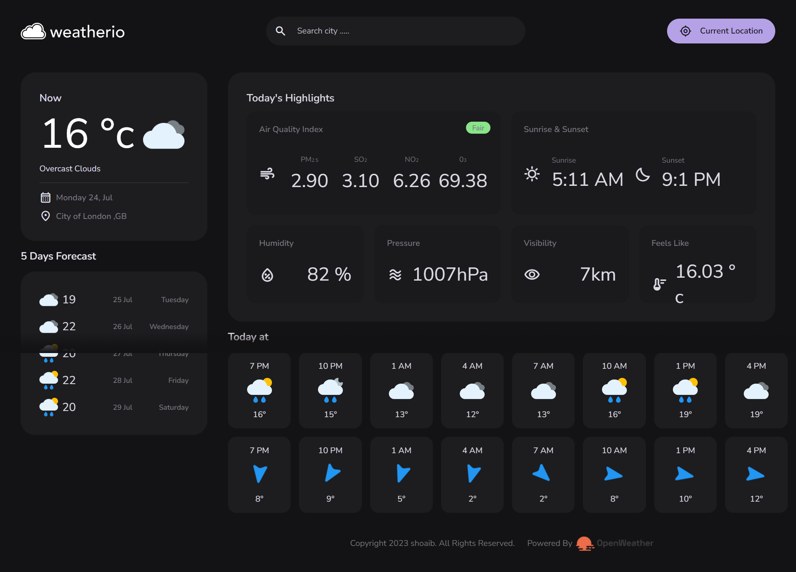

# Realtime Weather App

Responsive Real time Weather Map Built in HTML,CSS,JS

## Table of Contents
- [Demo](#demo)
- [Features](#features)
- [Technologies Used](#technologies-used)
- [Setup](#setup)
- [Usage](#usage)
- [APIs Used](#apis-used)
- [Contributing](#contributing)
- [License](#license)
- [Contact](#contact)

## Demo
### Desktop

### Live Demo
[Live Demo]([(https://moonlit-stardust-781644.netlify.app/#/current-location)])

## Features
- Update weather based on current location
- Search for weather updates of any location
- 5-day weather forecast
- Forecast weather data in next hours
- Air quality index, wind speed, direction, pressure, and humidity
- Responsive design for various devices

## Technologies Used
- HTML
- CSS
- JavaScript

## Setup
To run this project locally, follow these steps:

1. Clone the repository: `git clone https://github.com/Shoaib-Naseer/realtime-weather-app   .git`
2. Open the project folder: `cd your-repo`
3. Open `index.html` in your preferred web browser.

## Usage
- Upon opening the app, it will try to fetch weather data based on the user's current location.
- To search for weather updates of a specific location, use the search bar and enter the location name. Press Enter or click the Search button to get the results.
- The app will display the current weather conditions along with additional details like air quality index, wind speed, direction, pressure, and humidity.
- To view the 5-day weather forecast, scroll down or navigate to the respective section on the page.
- For detailed forecast weather data in the next hours, check the relevant section on the page.

## APIs Used
List the APIs you used in the project, along with any relevant links to their documentation.

- [OpenWeather Api for Current Weather](https://api.openweathermap.org/)
- [OpenWeather Api for Forecast](https://api.openweathermap.org/)
- [OpenWeather Api for Air Pollution](https://api.openweathermap.org/)
- [OpenWeather Api for Reverse Geo](https://api.openweathermap.org/)
- [OpenWeather Api for Geo](https://api.openweathermap.org/)

## Contributing
Contributions are welcome! If you find any bugs or have suggestions for improvements, please create an issue or submit a pull request.

## License
[MIT] © [ShoaibNaseer]

## Contact
For any questions or inquiries, please email [shoaibnaseer1111@gmail.com].
